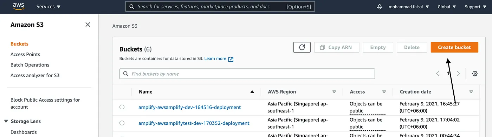

# How to Upload Files to AWS S3 in React

Today, with some awesome serverless cloud solutions like AWS and Firebase, uploading a file has become a piece of cake.

Today we will see how we can quickly create an S3 bucket and upload files directly from our front-end React application.

### <b>Pre Requisites</b>
1. An AWS Account
2. Basic Understanding of ReactJS

## Step 1. Create S3 Bucket
Log in to your aws console. Search for `Amazon S3` and click on `Create bucket`.



Then give it a name and select the proper region. Then uncheck the `Block all public access` just for now (You have to keep it unchecked in production).


Hit `Create Bucket` and you will see your new bucket on the list.

## Step 2. Edit Bucket Policy

Now we will set the bucket policy. Click on the bucket name and go to the `Permissions` tab.

Scroll down a bit, and you will see a section named `Bucket Policy`.

Click on the `Edit` button. and add the following `json`.

```json
{
    "Version": "2012-10-17",
    "Statement": [
        {
            "Sid": "PublicListGet",
            "Effect": "Allow",
            "Principal": "*",
            "Action": [
                "s3:List*",
                "s3:Get*"
            ],
            "Resource": [
                "arn:aws:s3:::BUCKET_NAME",
                "arn:aws:s3:::BUCKET_NAME/*"
            ]
        }
    ]
}
```

## Step 3. Edit CORS Policy

Scroll down a bit further, and you will get a section where you can edit the `CORS` policy. As we will be uploading files from another endpoint, we need to ensure that our bucket does not block that for cors.

Then add the following `.json` file to the policy.

```json
[
    {
        "AllowedHeaders": [
            "*"
        ],
        "AllowedMethods": [
            "PUT",
            "POST",
            "DELETE",
            "GET"
        ],
        "AllowedOrigins": [
            "*"
        ],
        "ExposeHeaders": []
    }
]
```

Now we are ready to upload files to our AWS S3 bucket. Now moving on with the frontend part.

## Step 4. Set Up React Project

To follow along, you will need a basic React project setup.

```bash
npx create-react-app aws-s3-upload
```

## Step 5. Upload File Via Native SDK

If we use other aws services in our project, then we have a special npm package for that named `aws-sdk`.

```bash
npm i aws-sdk
```

Then create a new component named `UploadImageToS3WithNativeSdk` and add the following code there

```jsx
import React ,{useState} from 'react';
import AWS from 'aws-sdk'

const S3_BUCKET ='YOUR_BUCKET_NAME_HERE';
const REGION ='YOUR_DESIRED_REGION_HERE';


AWS.config.update({
    accessKeyId: 'YOUR_ACCESS_KEY_HERE',
    secretAccessKey: 'YOUR_SECRET_ACCESS_KEY_HERE'
})

const myBucket = new AWS.S3({
    params: { Bucket: S3_BUCKET},
    region: REGION,
})

const UploadImageToS3WithNativeSdk = () => {

    const [progress , setProgress] = useState(0);
    const [selectedFile, setSelectedFile] = useState(null);

    const handleFileInput = (e) => {
        setSelectedFile(e.target.files[0]);
    }

    const uploadFile = (file) => {

        const params = {
            ACL: 'public-read',
            Body: file,
            Bucket: S3_BUCKET,
            Key: file.name
        };

        myBucket.putObject(params)
            .on('httpUploadProgress', (evt) => {
                setProgress(Math.round((evt.loaded / evt.total) * 100))
            })
            .send((err) => {
                if (err) console.log(err)
            })
    }


    return <div>
        <div>Native SDK File Upload Progress is {progress}%</div>
        <input type="file" onChange={handleFileInput}/>
        <button onClick={() => uploadFile(selectedFile)}> Upload to S3</button>
    </div>
}

export default UploadImageToS3WithNativeSdk;
```

> Replace BUCKET_NAME , REGION_NAME, SECRET_KEY, ACCESS_KEY with your own value
https://docs.aws.amazon.com/powershell/latest/userguide/pstools-appendix-sign-up.html

## Step 6. Upload File Via React S3

If you are not using other AWS services, then you don’t need the full `aws-sdk` which will unnecessarily increase your bundle size.

We will use another library named `react-s3`. 

```bash
npm i react-s3
```

Then create a new component named `UploadImageToS3WithReactS3` and add the following code.

```jsx
import React , {useState} from 'react';
import { uploadFile } from 'react-s3';


const S3_BUCKET ='YOUR_BUCKET_NAME';
const REGION ='YOUR_REGION_NAME';
const ACCESS_KEY ='YOUR_ACCESS_KEY';
const SECRET_ACCESS_KEY ='YOUR_SECRET_ACCESS_KEY';

const config = {
    bucketName: S3_BUCKET,
    region: REGION,
    accessKeyId: ACCESS_KEY,
    secretAccessKey: SECRET_ACCESS_KEY,
}

const UploadImageToS3WithReactS3 = () => {

    const [selectedFile, setSelectedFile] = useState(null);

    const handleFileInput = (e) => {
        setSelectedFile(e.target.files[0]);
    }

    const handleUpload = async (file) => {
        uploadFile(file, config)
            .then(data => console.log(data))
            .catch(err => console.error(err))
    }

    return <div>
        <div>React S3 File Upload</div>
        <input type="file" onChange={handleFileInput}/>
        <button onClick={() => handleUpload(selectedFile)}> Upload to S3</button>
    </div>
}

export default UploadImageToS3WithReactS3;
```
